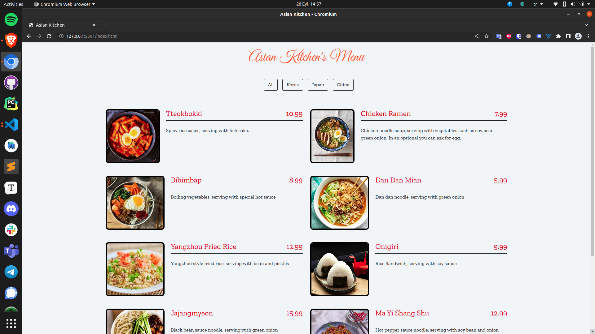

# asian-kitchen
---

This template will help you get started with JavaScript development.

# Recommended IDE Setup
---

Recommended IDE Installation
We recommend using VSCode.

# Project image
---

The image of the Web Page will look like this:

# Project clone
---

To copy the project you can copy from here:

`git@github.com:ali-bakir/asiaKitchen.git`

# Patika Link
---

You can find the link to path.dev here:
[Patika Link](https://app.patika.dev/alibakr)

